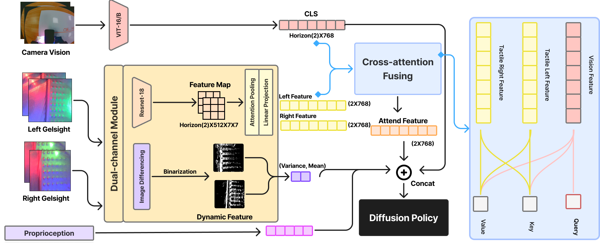

# GelFusion: Enhancing Robotic Manipulation under Visual Constraints via Visuotactile Fusion

[Project](https://gelfusion.github.io/) | [arXiv](https://arxiv.org/abs/2505.07455v1) | [Summary Video](https://youtu.be/YwoxCyPOEAY)



Visuotactile sensing offers rich contact information that can help mitigate performance bottlenecks in imitation learning, particularly under vision-limited conditions, such as ambiguous visual cues or occlusions. Effectively fusing visual and visuotactile modalities, however, presents ongoing challenges.
We introduce GelFusion, a framework designed to enhance policies by integrating visuotactile feedback, specifically from high-resolution GelSight sensors. GelFusion using a vision-dominated cross-attention fusion mechanism incorporates visuotactile information into policy learning. To better provide rich contact information, the framework's core component is our dual-channel visuotactile feature representation, simultaneously leveraging both texture-geometric and dynamic interaction features.
We evaluated GelFusion on three contact-rich tasks: surface wiping, peg insertion, and fragile object pick-and-place. Outperforming baselines, GelFusion shows the value of its structure in improving the success rate of policy learning.
## Install & Env setting

> Our python version = 3.10, mainly for Fairino's(manipulator) Interface. Recommended Python version > 3.8) 

Only tested on Ubuntu 22.04

We also recommend [Miniforge](https://github.com/conda-forge/miniforge) instead of the standard Anaconda distribution for faster installation, and suggest using mamba (included by default) to significantly speed up package solving and environment management.

```
mamba env create -f environment.yaml
```
Activate environment

```
conda activate GelFusion
```

## Data Collecting & Processing 

For data collection, all our data is gathered through remote operation using an Xbox controller. Considering that the specific manipulators and grippers used may vary, the reference value might have certain limitations. Nevertheless, we still provide the collection program for reference. For details, please refer to `DataCollection/DataCollection.py`.
Here, our structure is inspired by the [UMI](https://github.com/real-stanford/universal_manipulation_interface) code.

### Dataset Format  

We used the [`ReplayBuffer`](https://umi-data.github.io/#:~:text=%F0%9F%93%9A-,UMI%20Dataset%20Format,-UMI%20has%20multiple) format from UMI to package our raw data. The zarr data format ensures excellent GPU I/O efficiency during training and, when combined with `imagecodecs`, achieves high data compression rates. This makes it well-suited for server-based operations.  

For more details, refer to the ReplayBuffer documentation in the UMI dataset. One key consideration is that RGB data processing has the most significant impact on I/O efficiency. For RGB data, the `chunks` should be set to 1 to avoid redundant data reads when loading each chunk. Use `.get_chunks()` to check the current chunk size of the dataset.  

```
replay_buffer.get_chunks()

{'camera0_rgb': (1, 224, 224, 3),
 'diff_indensity': (298, 2),
 'gel_left_rgb': (1, 224, 224, 3),
 'gel_right_rgb': (1, 224, 224, 3),
 'robot0_demo_end_pose': (298, 6),
 'robot0_demo_start_pose': (298, 6),
 'robot0_eef_pos': (298, 3),
 'robot0_eef_rot_axis_angle': (298, 3),
 'robot0_gripper_width': (298, 1)}
```  

For other data types, the default chunk size is sufficient. Although `ReplayBuffer` provides an efficient data storage solution, it also has some limitations. Since zarr is a persistent data structure, it can be challenging to remove or add data. This issue may become more pronounced with larger datasets, and we look forward to a better solution in the future.  

Finally, the packaged dataset can be inspected using `replay_buffer.__repr__`, which produces the following output:  

```
<bound method ReplayBuffer.__repr__ of /
 ├── data
 │   ├── camera0_rgb (1434, 224, 224, 3) uint8
 │   ├── diff_indensity (1434, 2) float32
 │   ├── gel_left_rgb (1434, 224, 224, 3) uint8
 │   ├── gel_right_rgb (1434, 224, 224, 3) uint8
 │   ├── robot0_demo_end_pose (1434, 6) float32
 │   ├── robot0_demo_start_pose (1434, 6) float32
 │   ├── robot0_eef_pos (1434, 3) float32
 │   ├── robot0_eef_rot_axis_angle (1434, 3) float32
 │   └── robot0_gripper_width (1434, 1) float32
 └── meta
     └── episode_ends (2,) int64>
```

For more details on data processing, please refer to `DataProcessing/Tac_res_processing_DIffI.py`.

You can access our data through [Hugging Face](https://huggingface.co/datasets/shu1ong/GelFusion), where the corresponding tactile GelSight images have been packaged and processed, including inter-frame residual processing and background removal.


## Model Training

### Configuring Accelerate

When `GelFusion` is activated, configure Accelerate for multi-GPU training:
```
accelerate config
```

### Launching Accelerate

Use `train.py` to start training. Here, we provide a shell script for convenient parameter adjustments:
```
sh train_start.sh
```

**Parameter Explanation**

> **CONFIG_NAME**: Specify your configuration file name (excluding path and extension).
> - Example: `train_diffusion_unet_timm_umi_workspace`
>
> **DATASET_PATH**: Specify the path to your `replay_buffer.zip`, which can be relative or absolute.
>
> **RESUME**: Set to `True` if resuming training.
>
> **CHECKPOINT_PATH**: The path to save your checkpoints.
>
> **RUN_ID**: Your task ID on Weights & Biases (wandb).


## Model Inference

The inference of the model can be performed by referring to `scripts_real/eval/eval_real_gelfusion.py`.

## Acknowledgement
During the development of this repository, we were inspired by the excellent code architecture of [Diffusion Policy](https://github.com/real-stanford/diffusion_policy), [UMI](https://github.com/real-stanford/universal_manipulation_interface) and [ManiWAV](https://github.com/real-stanford/maniwav). We would like to express our deepest gratitude to the Robotics & Embodied Artificial Intelligence Lab team for open-sourcing such an outstanding codebase to the community. Their remarkable work has significantly advanced the field of imitation learning, and we sincerely appreciate their contributions to promoting open research and development in this area.

## BibTex

If you find this codebase useful, consider citing:

```bibtex
@misc{jiang2025gelfusionenhancingroboticmanipulation,
      title={GelFusion: Enhancing Robotic Manipulation under Visual Constraints via Visuotactile Fusion}, 
      author={Shulong Jiang and Shiqi Zhao and Yuxuan Fan and Peng Yin},
      year={2025},
      eprint={2505.07455},
      archivePrefix={arXiv},
      primaryClass={cs.RO},
      url={https://arxiv.org/abs/2505.07455}, 
}
```


